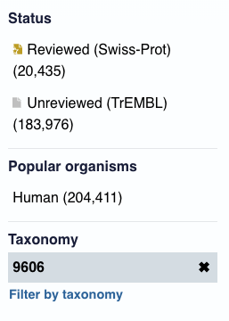
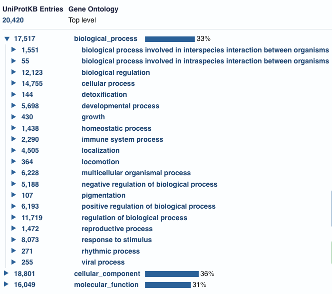
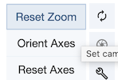
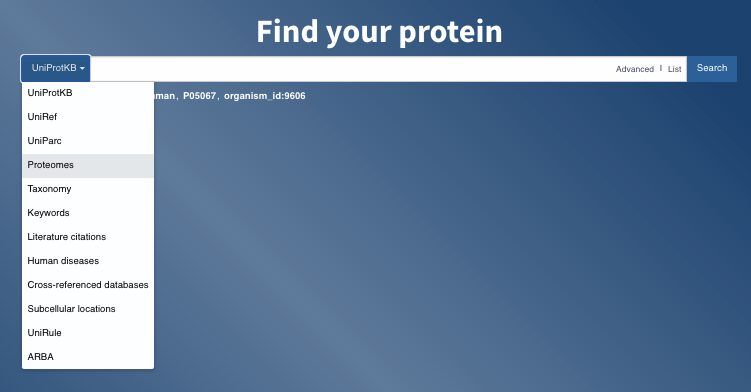

# TP 1 : Séquence - structure - fonction

## Table des matières

- [Auteurs](#auteurs)
- [Introduction](#introduction)
- [Ressources bioinformatiques](#ressources-bioinformatiques) 
- [Annotations fonctionnelles dans Uniprot](#annotations-fonctionnelles-dans-uniprot) 
    - [Requête naïve](#requête-naïve)
    - [Requête avancée](#requête-avancée)
    - [Annotations fonctionnelles](#annotations-fonctionnelles)
    - [Exercices](#exercices)

- [Analyse de la structure des protéines](#analyse-de-la-structure)
    - [Ressources](#ressources)
    - [Exploration de PDB](#exploration-de-pdb)
    - [Transporteur de glucose](#transporteur-de-glucose)

- [Exercices supplémentaires](#exercices-supplémentaires)
    - [Analyse de la structure avec icn3D](#facultatif-analyse-de-la-structure-avec-icn3d)
    - [Protéome de référence](#protéome-de-référence)
    - [Facultatif: challenge intergalactique de la plus belle image de structure de protéine](#facultatif-challenge-intergalactique-de-la-plus-belle-image-de-structure-de-protéine)

## Auteurs

- Jacques van Helden

----------------------------------------------------------------

## Introduction

### But du TP

Durant cette séance de TP, nous analyserons le lien entre séquence, structure tridimensionnelle et fonction des protéines. 

### Exemples traités


### Notions abordées

Ce TP mobilisera les notions suivantes abordées au cours

- Annotation des séquences protéiques
- Eléments structurels (hélice alpha, chapine bêta)

### Compétences acquises au cours de ce TP

- Effectuer une recherche structurée dans une base de connaissances (Swissprot) ou de données (Uniprot)
- Interpréter les annotations fonctionnelles d'une protéine
- Utiliser des modes de visualisation appropriés pour mettre en évidence différentes propriétés des protéines
- Etablir le lien entre annotations fonctionnelles et éléments structurels

----------------------------------------------------------------

## Ressources bioinformatiques

| Ressource | Description | URL |
|:---------------|:-------------------------------------------|:--------------------------------|
| Uniprot | principale base de données mondiale de séquences protéiques et d'informations fonctionnelles | [https://www.uniprot.org/](https://www.uniprot.org/) |
| PDB | Protein Databank, base de données de sructures protéiques | [https://www.rcsb.org/](https://www.rcsb.org/) |
| icn3D | Outil de visualisation et d'analyse des structures protéiques (NCBI) | [https://www.ncbi.nlm.nih.gov/Structure/icn3d/](https://www.ncbi.nlm.nih.gov/Structure/icn3d/) |

----------------------------------------------------------------

## Annotations fonctionnelles dans Uniprot

Ce tutoriel vise à se familiariser avec l'interface de la base de données et de connaissances Uniprot. 

Durant le TP, vous apprendrez à :

- effectuer une requête avancée (structurée) pour sélectionner des protéines sur base d'un ou plusieurs critères combinés 
- sélectionner un protéome de référence
- explorer les annotations fonctionnelles basées sur la Gene Ontology


### Requête naïve

Dans un premier temps nous allons faire une requête "naïve" en entrant "Human" dans la boîte de recherche. 

1. Ouvrez une connexion à Uniprot ([uniprot.org](https://uniprot.org))

2. Cliquez **Search** en veillant à laisser la boîte de recherche vide. Ceci sélectionnera l'ensemble des entrées la base de données. 

3. Connectez-vous à Ametice et répondez à la première section questionnaire du TPa1: **Questionnaire TP1a - Requêtes sur UniprotKB**. 

    - Dans UniprotKB, quel est le nombre total de protéines ? (les nombres proposés datent du 24 septembre 2024, ils peuvent fluctuer en cours de semestre)
    - Dans UniprotKB, quel est le nombre de protéines révisées par un annotateur ?
    - Comment s'appelle la base de connaissances des protéines révisées par des annotateurs ?
    - Swiss-prot est (a) une base de données; (b) une base de connaissances
    - Dans UniprotKB, quel est le nombre de protéines non révisées par un annotateur (tous organismes confondus) ? 
    - Comment s'appelle la base de données des protéines non révisées par des annotateurs ?
    - TrEMBL est (a) une base de données; (b) une base de connaissances

3. Dans la boîte de recherche, tapez "Human" et cliquez "Search"


4. Dans la boîte de recherche, tapez "Human" et cliquez "Search". Connectez-vous à Ametice et répondez à la deuxième section questionnaire du TPa1: **Questionnaire TP1a - Requêtes sur UniprotKB**. 

    - Dans la boîte de recherche, tapez "Human" et cliquez "Search". Combien de résultats obtenez-vous au total ? **Attention: pour entrer une réponse numérique, n'utilisez aucun séparateur de milliers (ni point ni virgule ni espace)**
    - Dans la boîte de recherche, tapez "Human" et cliquez "Search". Combien de résultats obtenez-vous dans Swiss-prot ?
    - Dans la boîte de recherche, tapez "Human" et cliquez "Search". Combien de résultats obtenez-vous dans TrEMBL ?
    - Dans la boîte de recherche, tapez "Human" et cliquez "Search". Dans la section "Popular organisms" du panneau de gauche, combien de protéines sont associées à l'humain ?
    - Dans la boîte de recherche, tapez "Human" et cliquez "Search". Dans la section "Popular organisms" du panneau de gauche, quel est l'organisme le plus représenté, à part l'humain ? Ecrivez les noms d'organismes sous la forme où ils sont affichés sur la page d'Uniprot.

5. Dans la section "Popular organisms", cliquez "Human".  Connectez-vous à Ametice et répondez à la troisième section questionnaire du TPa1: **Questionnaire TP1a - Requêtes sur UniprotKB**. 

    - Combien de résultats obtenez-vous dans Swiss-Prot ?
    - Combien de résultats obtenez-vous dans TrEMBL ?


### Requête avancée

Nous avons vu ci-dessus qu'une requête naïve peut s'avérer trompeuse, car elle retourne toutes les entrées d'Uniprot qui contiennent les termes de la boîte de recherche, sans tenir compte de l'endroit où ces termes apparaissent dans les annotations. On peut donc se retrouver avec des tas de protéines non-humaines, qui sont sélectionnées parce que le mot "Human" apparaît dans l'un ou l'autre champ (par exemple "similar to Human ...").

Nous recommandons donc fortement d'éviter cela, et de recourir systématiquement aux requêtes avancées. 

1. Revenez à la page d'accueil d'Uniprot en cliquant sur l'icône "Uniprot" en haut à gauche. 
2. Dans la boîte "Find your protein", cliquez le lien "Advanced"
3. Les boîtes bleues vous permettent de restreindre votre recherche à un ou plusieurs champs particulier. Cliquez sur la première boîte bleue, et sélectionnez "Organism [OS]", puis tapez "Homo sapiens" dans la boîte de recherche. Un menu déroulant apparaît avec les différentes possibilités pour Homo sapiens, choisissez la première option ("Homo sapiens (Human/Man) [9606]")


| Requête avancée | Nombre de résultats |
|:------------------------------------:|:------------------------------------|
|  |  |

**Info:** 9606 est l'identifiant taxonomique de l'espèce *Homo sapiens* dans la base de données taxonomique de référence, qui est gérée par le NCBI. Vous pouvez consulter les informations associées en cherchant "Homo sapiens" sur [www.ncbi.nlm.nih.gov/Taxonomy/](https://www.ncbi.nlm.nih.gov/Taxonomy/)

Voici le lien direct: 
- [www.ncbi.nlm.nih.gov/Taxonomy/Browser/wwwtax.cgi?id=9606](https://www.ncbi.nlm.nih.gov/Taxonomy/Browser/wwwtax.cgi?id=9606)

On notera que ce taxon *inclut* deux variétés fossiles 
- [Homo sapiens neanderthalensis](https://www.ncbi.nlm.nih.gov/Taxonomy/Browser/wwwtax.cgi?id=63221)
- [Homo sapiens subsp. 'Denisova'](https://www.ncbi.nlm.nih.gov/Taxonomy/Browser/wwwtax.cgi?mode=Info&id=741158)


### Annotations fonctionnelles

Nous avons maintenant sélectionné le protéome de référence de l'espèce *Homo sapiens* dans Uniprot. 

Le panneau de gauche permet d'explorer de façon interactive différentes propriétés de ce protéome. 

1. Nous effectuerons cette exploration en nous limitant au sous-ensemble des protéines révisées. Pour cela, cliquez sur "Reviewed (Swiss-Prot)" dans le panneau de gauche.  Ceci restreindra les analyses suivantes aux 20.420 protéines les mieux documentées pour l'humain. 

2. Dans la section "Group by" du panneau de gauche, cliquez "Gene Ontology". Ceci vous affiche le nombre de protéines (parmi les 20.420) pour lesquelles on dispose d'annotation dans chacune des trois catégories de la Gene Ontology: 

    - 17.517 biological_process
    - 18.801 cellular_component
    - 16.049 molecular_function
    
3. Les triangles à gauche de chaque nombre permettent de déployer le niveau suivant de la classification hiérarchique des termes de l'ontologie. Cliquez sur le triangle à gauche de "biological process" pour afficher ses sous-catégories. 



Notez que la somme des nombres des sous-catégories dépasse de loin la taille de la catégorie parente (biological process. Ceci est logique, car une même protéine peut appartenir à plusieurs classes simultanément. Par exemple, une protéine pourrait être impliquée dans la régulation biologique (12.123 protéines) positive (6.193 protéines) d'un processus de développement (5.698 protéines). Cette protéine sera donc comptée 3 fois à ce niveau de la classification. 


----------------------------------------------------------------

## Analyse de la structure des protéines


Nous allons maintenant combiner les informations de Swiss-prot et de la Protein Data Bank (PDB) pour étudier quelques cas illustratifs de relations entre la séquence, la structure et fonction des protéines. 


### Exploration de PDB

Nous commençons ce TP par explorer sommairement l'interface usager de Protein Data Bank, la base de données de référence pour les structures tridimensionnelles des protéines. 

1. Ouvrez une connexion à PDB ([www.rcsb.org](https://www.rcsb.org))
2. En haut à gauche de la fenêtre, la page web affiche le nombre toal de structures expérimentales, et le nombre total de modèles prédits (computed).  

3. En cliquant sur le nombre de structures (expérimentales) affiché en haut de la page d'accueil (*Structures from the PDB*), vous pourrez observer la répartition de ces structures. Observez le nombre de structures expérimentales caractérisées par organisme, groupe taxonomique, méthode expérimentale, ...


    - Combien de structures (expérimentales) contient PDB ?
    - Quel est l'organisme le plus représenté pour les structures expérimentales ?
    - Quelle est la méthode la plus utilisée pour caractériser les structures expérimentales ?
    - PDB contient d'autres types de macromolécules que les protéines. Citez en un.  
    - Combien PDB contient-elle de modèles de structures prédites (computed structure models)) ?
    - Quelle est la méthode la plus utilisée pour les structures prédites ?
    - Quel est l'organisme le plus représenté pour les structures prédites ?
    - Quel est le groupe taxonomique le plus représenté pour les structures prédites ?


----------------------------------------------------------------

### Transporteur de glucose

Pour les exercices suivants, nous allons nous concentrer sur un cas d'étude : le transporteur de glucose de l'humain. Nous commencerons par analyser les annotations fonctionnelles de cette protéine sur Uniprot, et nous utiliserons ensuite les outils de PDB (Protein Data Bank) pour analyser le lien entre les différents domaines topologiques de sa séquence et sa structure tridimensionnelle.

### Annotations du transporteur de glucose dans Uniprot

1. Dans [Uniprot](https://www.uniprot.org/), ouvrez la fiche de la protéine dénommée "Solute carrier family 2, facilitated glucose transporter member 1" (identifiant [GTR1_HUMAN](https://www.uniprot.org/uniprotkb/P11166))

2. Consultez la section "[Subcellular location](https://www.uniprot.org/uniprotkb/P11166/entry#subcellular_location)". Répondez aux questions suivantes sur Ametice (Questionnaire TP1c)

    - Quelle est la localisation sous-cellulaire principale de cette protéine ?
    - Combien y a-t-il de domaines transmembranaires annotés dans la section "Features" ?
    - Quel est le type des éléments de structure des domaines transmembranaires du transporteur de glucose ?
    - Combien y a-t-il d'autres domaines topologiques annotés dans la sous-section "Features" de "Subcellular location" ?
    - Combien y a-t-il de domaines cytoplasmiques dans le transporteur du glucose ?
    - Combien y a-t-il de domaines extracellulaires dans le transporteur du glucose ?

3. Consultez la section "[Diseases and variants](https://www.uniprot.org/uniprotkb/P11166/entry#disease_variants)"

    - Quels sont les types de pathologies associés aux mutations de cette protéine ?

### Profils transcriptomiques tissulaires (sur GTEx)

4. Dans un onglet séparé, connectez-vous au portail GTEx ([gtexportal.org/](https://gtexportal.org/)) et consultez le profil transcriptomique du gène qui code pour cette protéine (vous trouverez son nom dans la section "[Names and taxonomy](https://www.uniprot.org/uniprotkb/P11166/entry#names_and_taxonomy)" de la fiche Uniprot)

    - dans quels tissus ce gène est-il principalement exprimé ?
    - voyez-vous un lien avec les pathologies suscitées par des mutations de ce gène ?

### Structure du transporteur de glucose: d'Uniprot à PDB

5. Revenez à la page de cette  protéine (P11166) dans Uniprot et consultez la section "[Structure](https://www.uniprot.org/uniprotkb/P11166/entry#structure)". 

    - Combien y a-t-il de structures disponibles ? 
    - Combien y a-t-il de structures caractérisées expérimentalement ? 
    - Par quelle(s) méthode(s) expérimentale(s) ont-elles été caractérisées ?
    - Quelle est la meilleure résolution (en Angstroms) ?
    


6. Cliquez sur le lien "[RCSC-PDB](https://www.rcsb.org/structure/6THA)" de la structure  avec la meilleure résolution (**6THA**). Ceci ouvre un nouvel onglet vers le serveur RCSC-PDB. 

Dans la seection suivante, nous utiliserons ce serveur pour visualiser la structure du transporteur du glucose et analyser la relation entre séquence et structure. Conservez toutefois l'onglet Uniprot ouvert, nous serons amenés à faire des aller-retours entre PDB et Uniprot. 


### Analyse des relations séquence - structure sur PDB


#### Tutoriel : affichage des annotations de séquence sur la structure

1. Consultez rapidement les annotations de la structure intitulée ["Crystal structure of human sugar transporter GLUT1 (SLC2A1) in the inward conformation" (identifiant PDB 6THA)](https://www.rcsb.org/structure/6THA) sur le serveur RCSB-PDB. Evaluez les types d'informations disponibles. Notez que la page propose une série d'onglets avec différents types d'information (Structure, Annotations, Experiment, Sequence, Genome, Ligands, Versions). Dans ce tutoriel, nous combinerons les informations de séquence et de structure. 

2. Dans la section "Explore 3D" sous l'image de la structure, cliquez "[Sequence annotations](https://www.rcsb.org/3d-sequence/6THA?assemblyId=1)". Ceci ouvre une page avec deux deux panneaux : 

    - à gauche, une carte présentant différentes pistes d'annotation de la séquence protéiques (structures secondaires, "hydropathie", topologie membranaire, segments de membrane...
    - à droite, une représentation de la structure tridimensionnelle de la protéine, affichée en mode "ribbon"
    
Nous allons commencer par personnaliser l'affichage de la protéine, et nous explorerons ensuite les relations entre les caractéristiques de la séquence (panneau de gauche) et de la structure (panneau de droite). 

3. En haut à droite de la fenêtre, une série d'icones vous proposent différents outils pour manipuler et analyser la structure. Un premier click sur une icône affiche l'outil, un second click le masque. Cliquez sur l'icône de clé à molette. Ceci affichera deux nouveaux panneaux :

    - à droite, une boîte à outils présentant de nombreuses options de personnalisation de l'affichage et d'anlayse de la structure
    - au-dessus de la structure, la séquence de la protéine

Vous pouvez déplacer la limite verticale entre le panneau d'annotation et celui de structure pour qu'ils occupent chacun la moitié de l'écran (sans compter le panneau d'outils). 


4. Dans la section "Components" de la boîte à outils, masquez les molécules d'eau et les ions en cliquant sur l'oeil. Testez également l'effet de l'affichage / masquage des autres composantes de la structure, puis veillez à réactiver leur affichage.

5. Nous allons maintennat colorer la protéine pour mettre en évidence ses éléments de structure. A côte de la composante "A", cliquez l'icône `...` pour afficher les options de représentation de la protéine. L'affichage par défaut se fait au niveau de la chaîne polypeptidique, ce qui peut être intéressant pour des complexes protéiques ou protéine-ADN, mais n'est pas très illustratif quand on visualise une protéine composée d'une seule chaîne polypeptidique, ce qui est notre cas. Testez des modes alternatifs de représentation au niveau des propriétés des résidus et interprétez ce que vous voyez. Retenez ensuite la propriété "Sequence ID", qui assigne une couleur différente à chaque élément structurel, selon un gadient du bleu au rouge. 

8. Après avoir personnalisé l'affichage des éléments de structure, nous allons sélectionner différents segments annotés de la protéine (panneau de gauche), et les localiser sur la structure tridimensionnelle (panneau de droite). Cliquez successivement sur les segments de la piste d'annotation "Membrane topology" et identifiez les éléments structurels (hélices alpha, feuillets beta) correspondants. Explorez en particulier les éléments structurels (rectangles roses sur la piste "Secondary structure") et les annotations de topologie de membrane (rectangles verts ou violets sur les pistes "Membrane Topology"). 


Quand vous cliquez sur un élément, l'affichage de la structure est recadrée sur cet élément, dans le panneau de droite, et le segment de séquence correspondant est marqué dans la partie supérieure du panneau de droite. Pour voir l'élément dans le contexte global de la protéine, utilisez les options *Reset Zoom*. Faites tourner la structure pour afficher au mieux les segments que vous sélectionnez successivement. Vous pouvez à tout moment revenir à la position initiale avec la fonction *Reset Axes*.




#### Test

- Dans la position initiale de la structure (obtenie après avoir cliqué *Reset Axes*), les segments cytoplasmiques sont-ils situés : (a) en haut; (b) à droite (c); à gauche; (d) en bas. 
- Dans la position initiale de la structure (obtenie après avoir cliqué *Reset Axes*), les segments extracellulaires sont-ils situés : (a) en haut; (b) à droite (c); à gauche; (d) en bas. 
- Dans la position initiale de la structure (obtenie après avoir cliqué *Reset Axes*), les segments transmembranaires sont-ils orientés (a) verticalement; (b) horizontalement; (c) perpendiculairement à l'écran ?
- Quel est le type d'élément structurel associé aux segments transmembranaires ?
- Quels sont les types d'éléments structurels associés au plus grand segment cytoplasmique ?
- Quel est le type d'élément de structure associé plus grand segment extracellulaire ?

----------------------------------------------------------------

 
----------------------------------------------------------------

## Exercices supplémentaires

Les exercices suivants peuvent être réalisés soit en fin de séance de TP (si vous avez été très rapide), soit ultérieurement, à votre rythme. 


### Analyse de la structure avec icn3D


Cette section est facultative. Elle permettra à ceux qui le désirent de découvrir un autre outil Web pour l'analyse des structures de protéines. 

1. Dans un onglet séparé, connectez-vous au serveur [icn3D](https://www.ncbi.nlm.nih.gov/Structure/icn3d/), et entrez l'identifiant de la structure PDB (6THA) dans la boîte de requête, et pressez la touche "Entrée". Vérifiez que vous avez bien chargé la bonne structure : *"PDB ID 6THA: Crystal structure of human sugar transporter GLUT1 (SLC2A1) in the inward conformation"*.

2. Choisissez une coloration en arc-en-ciel pour repérer la position des différents éléments de structure par rapport aux extrémités de la chaîne polypeptidique (*Color -> Rainbow -> For Chains*). 


3. Testez les différents modes d'affichage de la protéine en explorant les options du menu *Styles -> Proteins* et tentez d'identifier l'intérêt des différents modes de représentation. En particulier, assurez-vous de comprendre les options d'affichage suivantes : 

    - C Alpha trace
    - Balls and stick
    - Sphere
    - Backbone
    - Ribbon

(la réponse à cette question peut faire l'objet d'un debriefing en séance)

3. Revenz à la représentation Ribbon, que nous utiliserons principalement pour la suite. 

4. Faites tourner la structure et localisez les molécules qui ne font pas partie de la protéine. Sélectionnez ces molécules (*Select -> Defined sets*, puis cliquez *chemicals* dans la boîte qui apparaît à droite de la fenêtre). Affichez-les en style "Balls and stick" (*Style -> Chemicals -> Balls and sticks*), et colorez-les en fonction des atomes (*Color -> Atom*). Désélectionnez ensuite ces molécules (*Select -> Clear Selection*). 

5. Sélectionnez la protéine (*Select -> Defined sets* puis *protein*) et colorez-la en fonction de la charge des résidus (*Color -> Charge*). Défaites la sélection pour mieux voir le résultat. 

    - estimez le nombre de résidus chargés positivement
    - estimez le nombre de résidus chargés négativement
    - estimez la proportion de ces résidus par rapport à la taille de la protéine

6. Analysez la localisation de ces résidus chargés, et interprétez le résultat dans le contexte des annotations d'Uniprot. 

    - quelle est la localisation majoritaire pour les résidus chargés ?
    - il y a-t-il des résidus chargés localisés dans les parties transmembranaires ?
    - si oui, sont-ils localisés du côté extérieur (membrane) ou intérieur (canal) du transporteur ?

### Protéome de référence

Le protéome d'un organisme consiste en l'ensemble de ses protéines. Dans Uniprot, les séquences protéiques proviennent de la traduction automatique de séquences génomiques. Avec la multiplication des projets de séquençages individuels d'humains, le nombre de séquences différentes a augmenté, avec une certaine redondance. 

Pour faciliter le travail, l'équipe d'Uniprot a défini le concept de "Protéome de référence". 

Après avoir effectué une requête avancée en cherchant *Homo sapiens* dans le nom d'organisme, le titre de la page de résultat inclut un lien vers le protéome de référence de l'humain. 


> UniProtKB 204,411 results or expand search to "9606" to include lower taxonomic ranks or restrict to reference proteome [UP000005640](https://www.uniprot.org/?query=(organism_id:9606)%20AND%20(proteome:UP000005640))

En cliquant sur le lien  [UP000005640](https://www.uniprot.org/?query=(organism_id:9606)%20AND%20(proteome:UP000005640)), on obtient un protéome totalisant 82.861 protéines dont 20.420 révisée par des annotateurs (Swiss-prot) et 62.441 non-révisées (TrEMBL). 

Notez que la boîte de requête affiche maintenant le texte structuré suivant:

```(organism_id:9606) AND (proteome:UP000005640)```

Vous pouvez construire des requêtes plus complexes avec l'outil "Advanced", qui vous permettra de combiner plusieurs critères de sélection avec différents opérateurs logiques (AND, OR). 

Pour consulter la liste des protéomes de référence, en revenant à la page d'accueil d'Uniprot, et en sélectionnant, à gauche de la boîte de recherche, la section "Proteomes"



Ceci remplace la boîte "Find your protein" par "Find your proteome"


Vous pouvez ensuite effectuer une requête avancée pour sélectionner le protéome de référence (Proteome type) de l'organisme modèle de votre choix (par exemple "Escherichia coli (strain K12) (E.coli) [83333]")


#### Exercices

1. Formulez une requête avancée sur l'ensemble des protéines du protéome de référence humain en sélectionnant les enzymes annotées dans Swiss-Prot, qui ont une localisation cytoplasmique et sont impliquées dans la voie canonique de la glycolyse. Combien de protéines obtenez-vous ?

    - *Coup de pouce : utilisez les classes de la Gene Ontology [GO] dans la requête avancée*
        - `canonical glycolysis (GO:0061621) [0061621]`
        - `cytoplasm (GO:0005737) [0005737]`

2. Sélectionnez le protéome de référence de l'un des organismes modèles suivants, et analysez la répartition de ses gènes aux deux premiers niveaux des processus biologiques de la gene ontology. 

    - Escherichia coli (strain K12) (E. coli) [83333]
    - Drosophila melanogaster (Fruit fly/D. melanogaster) [7227]
    - Bacillus subtilis (strain 168) (B. subtilis) [224308]
    - Saccharomyces cerevisiae (strain ATCC 204508 / S288c) (Baker’s yeast/Baker's yeast/Brewer’s yeast/S. cerevisiae) [559292]
    - Mus musculus (Mouse/House mouse/Laboratory mouse) [10090]
    - Rattus norvegicus (Laboratory rat/Buffalo rat/R. norvegicus/Rat/Norway rat/Brown rat) [10116]
    - Arabidopsis thaliana (Mouse-ear cress/Arabidopsis/A. Thaliana/Thale cress) [3702]
    - Oryza sativa subsp. japonica (Japanese rice/O. sativa/Japonica rice/Rice) [39947]
    - Macaca mulatta (Rhesus monkey/M. mulatta/Rhesus macaque) [9544]
    - Mycoplasma genitalium (strain ATCC 33530 / DSM 19775 / NCTC 10195 / G37)


    Pour l'organisme de votre choix, quels sont les valeurs suivantes ?
    
    - Nombre de protéines dans Uniprot
    - Nombre de protéines révisées
    - Nombre de protéines non-révisées
    - Pourcentage de protéines révisées
    
3. Dans Uniprot, ouvrez la fiche de la sous-unité alpha de l'hémoglobine humaine (Hemoglobin subunit alpha)

...

4. Dans le protéome de la levure du boulanger (Saccharomyces cerevisiae (strain ATCC 204508 / S288c) (Baker’s yeast/Baker's yeast/Brewer’s yeast/S. cerevisiae) [559292]), comptez le nombre de protéines appartenant aux classes suivantes : 

    - facteur transcripitionel se liant à l'ADN
    - transporteur
    - protéine cytoplasmique
    - protéine transmembranaire
    - protéine impliquée dans la voie métabolique de la glycolyse

5. Dans le protéome de référence de l'humain, combien y a-t-il de récepteurs olfactifs?

    - 12
    - 120
    - 1200
    - 12000
    - 120000


## Facultatif: challenge intergalactique de la plus belle image de structure de protéine

*Si vous le désirez*, vous pouvez participer au challenge de générer la plus belle image de structure tridimensionnelle de structure protéique. Cette activité ne vous donnera aucun bonus, mais elle vous permet de vous familiariser avec des outils de structure, et elle peut vous apporter la gloire intergalactique si vous faites partie des gagnants.  

**Défi :** en utilisant l'outil bioinformatique de votre choix, générez une image tridimensionnelle d'une structure protéique, en tentant d'utiliser au mieux les options d'affichage pour mettre en évidence les particularités structurelles et fonctionnelles de cette protéine. 

#### Instructions

- Vous pouvez sélectionner n'importe quelle protéine, pourvu que sa structure tridimensionnelle soit disponible dans une base de données. Vous devrez indiquer l'identifiant et l'URL de la structure. 
- Les complexes multi-protéines, protéine ADN ou autres sont acceptés, pour autant qu'ils incluent au moins une chaîne polypeptidique
- Les animations sont autorisées
- Vous pouvez soumettre jusqu'à 5 fichiers. Ceux-ci peuvent par exemple correspondre à des angles d'affichage différents.

**Dépôt des fichiers: ** sur Ametice

----------------------------------------------------------------


